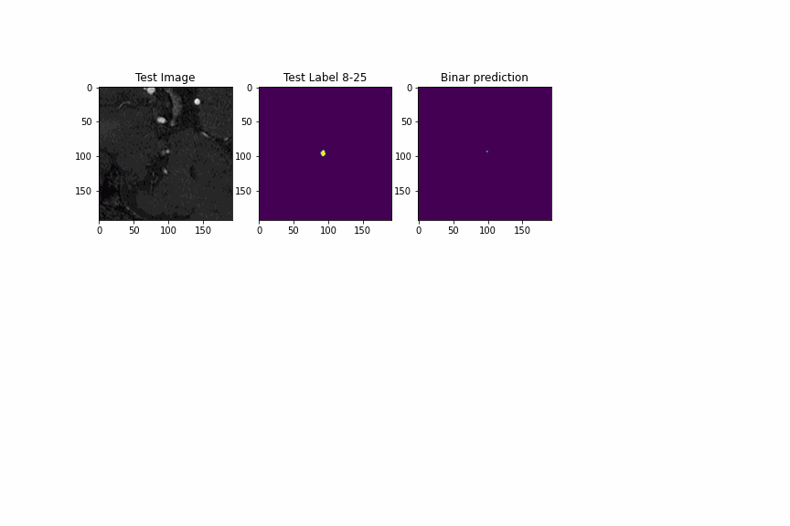

# 3D intracranial aneurysm semantic segmentation with 3D-Unet

In this project, we use various flavors of 3D-Unet to segment intracranial aneurysms in MRI scans.

The data is made of 103 scans, of shape (103, 64, 192, 192). Their mask are binary segmentations of the aneurysms. Scans are approximatively centered on the biggest aneurysm of the volume.

To explore your data, run ```explore_data.ipynb```.

To make predictions, you place your data to segment in a ```./to_predict/``` folder and follow the instructions of ```make_predictions.ipynb```. A pretrained model is required for the prediction task.

To train one, run the ```train_3Dunet.ipynb``` notebook and custom your training. We use both custom architectures and pre built ones (using segmentation-models-3d to try various encoder backbones), trained with augmented datsets (using volumentations-3d data augmentation tools).


